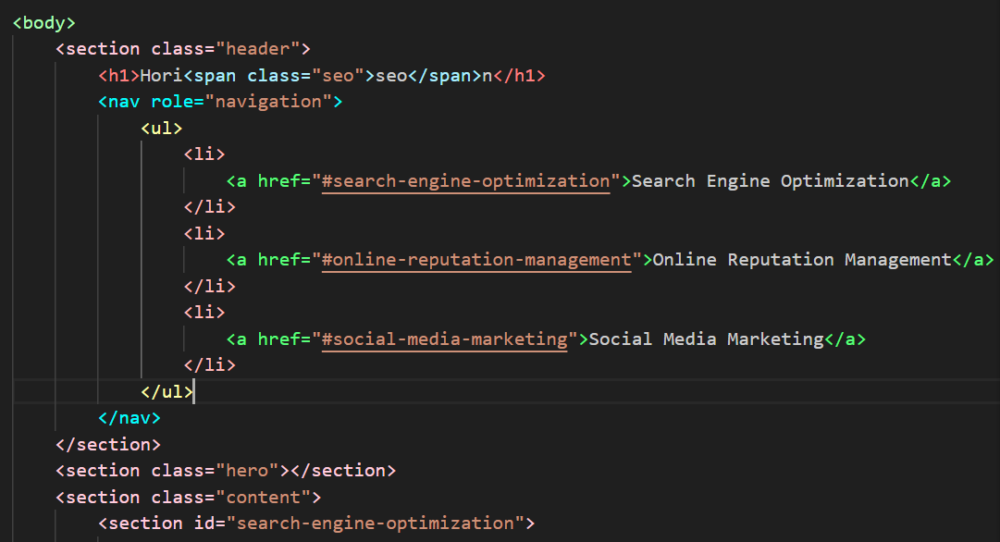
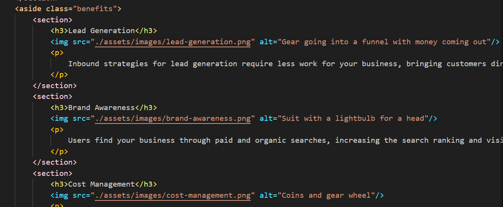

# Horiseon

## About the Project
Search Engine Optimization, Reputation management, and Social Media Marketing

## User Story

AS A developer,
I WANT to the HTML elements to be sematic, images to have alt tags, and the CSS to be easier to read.
SO THAT the code is easy to read and can be read by screenreaders.

## Problem

## Solution

